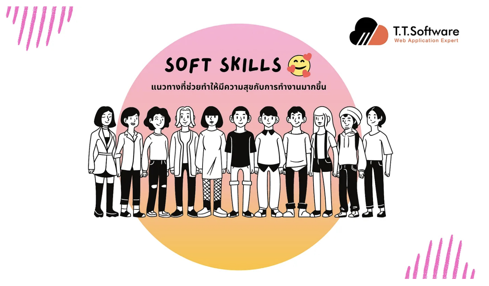
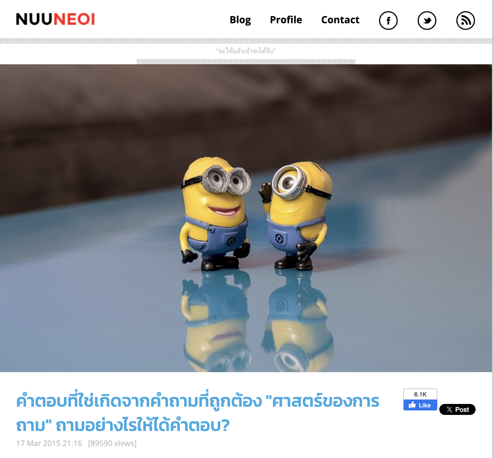
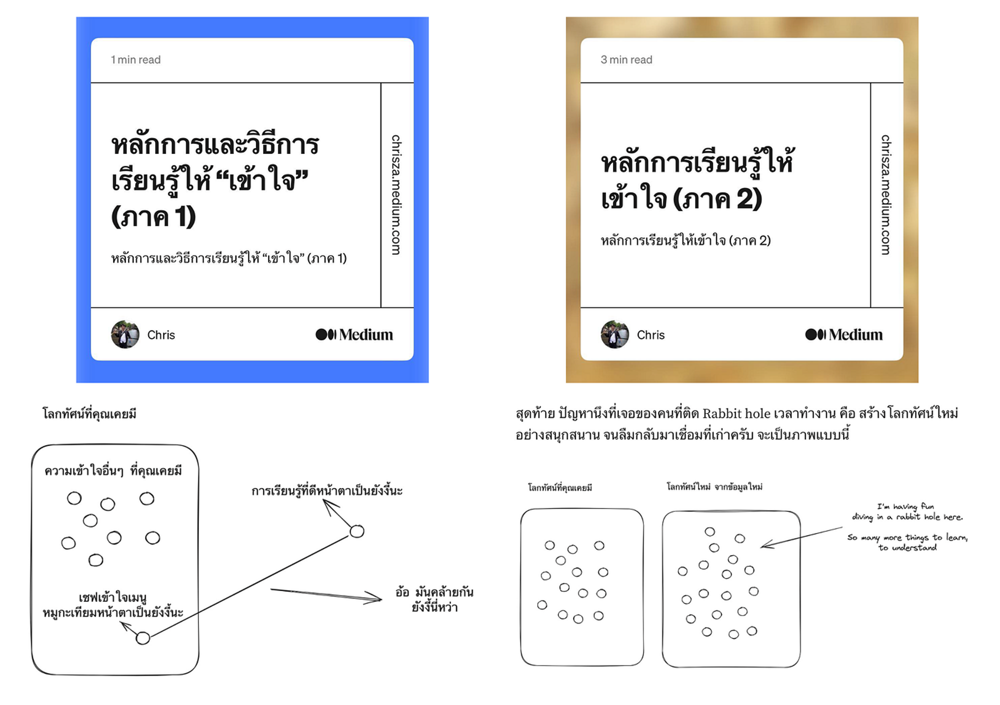
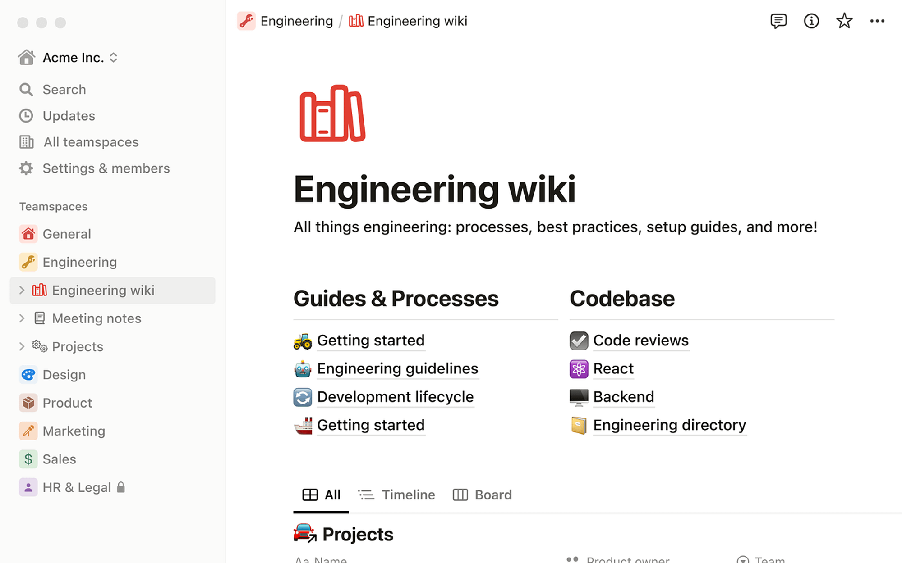

# Soft Skills

ทักษะในการทำงานแบ่งได้หลักๆอยู่สองประเภท คือ **Hard Skill** กับ **Soft Skill**

**`Hard Skills`** คือ Skill ตาม Job Description ของเราที่ต้องใช้เพื่อทำงานที่ได้รับมอบหมาย

แต่เอาเข้าจริงเรายังต้องการ Skill ที่มากกว่านั้นเพื่อทำให้งานเสร็จได้ เช่นการสื่อสารทั้งกับเพื่อนร่วมงานในทีม / ทีมอื่นๆ, การทำความเข้าใจ เจรจาต่อรองในเนื้อหาของงานที่ได้รับมอบหมาย

**`Soft Skills`** จะช่วยทำให้เรามีความสุขกับการทำงานมากขึ้นครับ เพราะช่วยเราปรับมุมมอง ปรับวิธีคิดของเราให้สามารถจัดการกับสถานะการต่างๆได้อย่างเข้าใจแท้จริงและมีประสิทธิภาพ รวมถึงยังช่วยให้เรามองโลกในแง่บวกอีกด้วย เพราะมองอะไรเป็นเหตุเป็นผลมากขึ้น

ในบทความนี้จึงอยากรวบรวมเนื้อหาที่เกี่ยวข้องกับเรื่องของ Soft Skills เพื่อให้ง่ายต่อการเรียนรู้เบื้องต้นกันนะครับ โดยเป็นเนื้อหาที่ผมเคยอ่านผ่านตามาทั้งหมดแล้วและมองเห็นว่าง่ายต่อการเรียนรู้ เห็นภาพที่เกิดขึ้นจริงนะครับ

[รวมเนื้อหาเพื่อการศึกษา Soft Skills](https://medium.com/t-t-software-solution/%E0%B8%A3%E0%B8%A7%E0%B8%A1%E0%B9%80%E0%B8%99%E0%B8%B7%E0%B9%89%E0%B8%AD%E0%B8%AB%E0%B8%B2%E0%B9%80%E0%B8%9E%E0%B8%B7%E0%B9%88%E0%B8%AD%E0%B8%81%E0%B8%B2%E0%B8%A3%E0%B8%A8%E0%B8%B6%E0%B8%81%E0%B8%A9%E0%B8%B2-soft-skills-1de94497055?source=post_page-----bc61325951d4--------------------------------)

## **ศาสตร์แห่งการตั้งคำถาม**

การตั้งคำถามสำคัญกับการเขียนโปรแกรมเนื่องจากหลายเหตุผล:

1. **ความชัดเจนในปัญหา**: การตั้งคำถามที่ถูกต้องช่วยให้เราเข้าใจปัญหาอย่างชัดเจน ซึ่งเป็นขั้นตอนแรกที่สำคัญที่สุดในการหาทางแก้ไขปัญหา ถ้าเราเข้าใจปัญหาอย่างถูกต้อง โอกาสที่จะหาคำตอบที่ถูกต้องก็สูงขึ้น
2. **การหาคำตอบที่ถูกต้อง**: การตั้งคำถามดีช่วยให้เราได้คำตอบที่มีประโยชน์ การถามที่ผิดหรือไม่มีชั้นเชิงอาจทำให้เราได้คำตอบที่ไม่ช่วยอะไรเลย ดังนั้นคำถามที่ดีมีผลต่อการได้คำตอบที่มีคุณภาพ
3. **การค้นคว้าและการเรียนรู้**: การตั้งคำถามช่วยในการค้นหาคำตอบจากแหล่งข้อมูลต่างๆ ไม่ว่าจะเป็นการถามผู้เชี่ยวชาญหรือการค้นหาในอินเทอร์เน็ต การตั้งคำถามที่ชัดเจนและถูกต้องช่วยให้การค้นคว้ามีประสิทธิภาพมากขึ้น
4. **การพัฒนาความคิดและการแก้ปัญหา**: การตั้งคำถามที่ดีไม่เพียงแค่ช่วยหาคำตอบ แต่มันยังช่วยพัฒนาการคิดและการแก้ปัญหา การถามคำถามที่มีคุณภาพจะช่วยให้เราปรับปรุงวิธีคิดและพัฒนาทักษะการแก้ปัญหา
5. **การพัฒนาอย่างต่อเนื่อง**: คนที่ตั้งคำถามเก่งและถูกต้องมีโอกาสที่จะพัฒนาและก้าวหน้าได้ไกลในอนาคต เนื่องจากพวกเขามีพื้นฐานของการไขว่คว้าหาความรู้อย่างไม่สิ้นสุด

ดังนั้น การตั้งคำถามเป็นทักษะที่สำคัญมากสำหรับการเขียนโปรแกรมและการพัฒนาตนเองในทุกๆ ด้านครับ ผมจึงอยากแนะนำวิธีการตั้งคำถามที่ดี จากคุณหนูเนยครับ

[NuuNeoI - คำตอบที่ใช่เกิดจากคำถามที่ถูกต้อง "ศาสตร์ของการถาม" ถามอย่างไรให้ได้คำตอบ](https://nuuneoi.com/blog/blog.php?read_id=806&source=post_page-----bc61325951d4--------------------------------)

## **บทความ: หลักการและวิธีการเรียนรู้ให้ “เข้าใจ”**

ผู้เขียน: คุณ [Chris](https://chrisza.medium.com/)

### **บทที่ 1 วิธีการเรียนรู้ให้เข้าใจมากขึ้น**

[บทที่ 1 วิธีการเรียนรู้ให้เข้าใจมากขึ้น](https://medium.com/chris-dialogue/%E0%B8%AB%E0%B8%A5%E0%B8%B1%E0%B8%81%E0%B8%81%E0%B8%B2%E0%B8%A3%E0%B9%81%E0%B8%A5%E0%B8%B0%E0%B8%A7%E0%B8%B4%E0%B8%98%E0%B8%B5%E0%B8%81%E0%B8%B2%E0%B8%A3%E0%B9%80%E0%B8%A3%E0%B8%B5%E0%B8%A2%E0%B8%99%E0%B8%A3%E0%B8%B9%E0%B9%89%E0%B9%83%E0%B8%AB%E0%B9%89-%E0%B9%80%E0%B8%82%E0%B9%89%E0%B8%B2%E0%B9%83%E0%B8%88-%E0%B8%A0%E0%B8%B2%E0%B8%84-1-a06e6cafc2e5?source=post_page-----bc61325951d4--------------------------------)

วิธีการเรียนรู้ให้เข้าใจนั้นประกอบด้วย

1. การเล่นกับข้อมูลที่ได้รับ เช่น หากเรียนรู้วิธีทำหมูทอดกระเทียมที่ต้องใส่ซีอิ๊วขาวสองช้อน
2. การเล่นกับข้อมูลก็คือการลองเปลี่ยนส่วนผสม เช่น ลองใส่ซีอิ๊วสามช้อน ใช้เกลือแทนซีอิ๊ว หรือลองใช้หมูส่วนต่างๆ ซึ่งการทดลองแบบนี้จะช่วยสร้างความเข้าใจลึกซึ้งในสิ่งที่เรียนรู้

หลักการสำคัญที่ผู้เขียนเน้นคือ การทำความเข้าใจไม่ได้เกิดจากการรับข้อมูลภายนอกเพียงอย่างเดียว แต่ต้องมีการสร้างโลกภายในผ่านการทดลองและการเล่นกับข้อมูล ซึ่งจะทำให้ความเข้าใจนั้นลึกซึ้งและไม่ต้องจำอะไรมากนัก

### **บทที่ 2 การเรียนรู้ที่เน้นการย่อยข้อมูลให้เข้ากับเรา**

[บทที่ 2 การเรียนรู้ที่เน้นการย่อยข้อมูลให้เข้ากับเรา](https://chrisza.medium.com/%E0%B8%AB%E0%B8%A5%E0%B8%B1%E0%B8%81%E0%B8%81%E0%B8%B2%E0%B8%A3%E0%B9%80%E0%B8%A3%E0%B8%B5%E0%B8%A2%E0%B8%99%E0%B8%A3%E0%B8%B9%E0%B9%89%E0%B9%83%E0%B8%AB%E0%B9%89%E0%B9%80%E0%B8%82%E0%B9%89%E0%B8%B2%E0%B9%83%E0%B8%88-%E0%B8%A0%E0%B8%B2%E0%B8%84-2-87142059124b?source=post_page-----bc61325951d4--------------------------------)

ในบทความ “หลักการเรียนรู้ให้เข้าใจ (ภาค 2)” ผู้เขียนได้อธิบายถึงหลักการเรียนรู้ที่เน้นการย่อยข้อมูลให้เข้ากับระบบภายในของเราเอง ซึ่งเปรียบเทียบกับ

1. การกินอาหารที่ต้องย่อยก่อนจึงจะกลายเป็นส่วนหนึ่งของร่างกาย
2. การเรียนรู้ก็เช่นกัน เราต้องนำข้อมูลที่ได้รับมาย่อยและปรับใช้ในบริบทของเรา เพื่อให้ข้อมูลนั้นกลายเป็นส่วนหนึ่งของความเข้าใจและความทรงจำของเราอย่างแท้จริง

การเข้าใจที่แท้จริงเกิดจากการที่เราสามารถเชื่อมโยงข้อมูลใหม่เข้ากับความรู้เดิมของเราได้อย่างสมบูรณ์ ซึ่งจะทำให้เราจดจำและนำไปใช้ได้โดยไม่ต้องย้อนกลับไปดูข้อมูลต้นทางอยู่บ่อยครั้ง

การเปรียบเทียบ ปรับโครงสร้าง หรือประยุกต์ใช้กับตัวอย่างจากชีวิตประจำวันเป็นวิธีการที่ช่วยเพิ่มประสิทธิภาพการเรียนรู้ในการเชื่อมโยงและย่อยข้อมูลใหม่ได้เป็นอย่างดี

#### **ตัวอย่างว่าจะประยุกต์ยังไง**

- Cap Theorem ให้เปรียบเทียบกับการมีธนาคารสองสาขาที่ต้องส่งข้อมูลกันผ่านกระดาษ และ Reception อาจจะไปเข้าห้องน้ำ อันนี้เราเชื่อมทฤษฎีเข้ากับอะไรที่เป็นประสบการณ์ของเรา
- API Design แบบใหม่ เปรียบเทียบระหว่างของเดิมที่เราทำกับของเก่า แล้วดูโฟกัสว่ามันต่างกันตรงไหนเหมือนกันตรงไหน
- ต้องไปแก้ Legacy system สมมติต้องไปทำงานปรับวิธีการแสดงราคา พอค้นคว้าข้อมูลไปซักพัก กลับมาเชื่อมตลอดว่า ที่เราเรียนมันจะไปใช้ปรับแสดงราคาได้ยังไงนะ แล้วตรงไหนต้องใช้ในงานประชุมพรุ่งนี้นะ
- ถ้าไปเรียนทฤษฎีบริหารใหม่ กลับมาเชื่อมว่าเอ้อชีวิตประจำวันที่เราทำงาน ตรงไหนใช้ได้บ้างไม่ได้บ้างนะ

#### **คำแนะนำจากผู้เขียน**

**ฝึกนิสัยในการเชื่อมต่อสิ่งที่เรารู้หรือเราต้องการ กับข้อมูลที่เราเรียน เพื่อป้องกันไม่ให้เกิดเหตุการที่เราเรียนรู้แต่ไม่สามารถช่วยให้แก้ปัญหาในงานได้เลย**

ถ้ายังไม่คล่อง ตั้งเวลาไว้ทุกๆ 15 นาที แล้วถามตัวเองว่า “ตกลงที่เราเรียนเนี่ยมันเกี่ยวกับสิ่งที่เราต้องทำยังไงนะ”แล้วถ้าไม่เกี่ยว ตัดทิ้งเลยครับ ไม่ต้องเสียดาย

1. กลับมาถามตัวเองว่าสิ่งนี้มันตรง ไม่ตรง กับสิ่งที่เราเคยรู้ยังไงบ้างนะ
2. ถ้าไม่ตรง มีอะไรที่เราต้องเปลี่ยนความเชื่อพื้นฐานของเราเพื่อให้รับข้อมูลใหม่นี้ได้บ้างนะ หรือเราจะทิ้งข้อมูลใหม่ไปก่อนดีนะ
3. เราจะเชื่อมสิ่งที่เรารู้และจำได้ขึ้นใจ กับสิ่งใหม่ได้ยังไงบ้างนะ
4. กระบวนการย่อยข้อมูล #1 — #3 คือการทบทวนเนื้อหาที่เราเรียนใหม่ได้อย่างมีประสิทธิภาพ มากว่าการที่เรากลับมาทบทวนด้วยการอ่านซ้ำๆเพื่อจดจำเนื้อหา

## เทคนิคเพิ่มประสิทธิภาพการทำงาน ด้วย Second Brain และ Notion

### Notion
เป็นเครื่องมือที่มีความสามารถหลากหลายในการจัดการข้อมูลส่วนบุคคล ทำให้เหมาะสมกับการสร้าง Second Brain โดยมีฟีเจอร์หลักๆ ดังนี้:

- **Pages**: หน้าสำหรับเก็บบันทึกต่างๆ ที่สามารถจัดเรียงเป็นลำดับชั้นได้
- **Databases**: ฐานข้อมูลที่ช่วยในการจัดเก็บข้อมูลรูปแบบต่างๆ เช่น ตาราง แกลเลอรี่ และรายการ
- **Templates**: แม่แบบที่ช่วยในการสร้างบันทึกหรือหน้าที่มีรูปแบบเดียวกันอย่างรวดเร็ว
- **Linked Databases**: การเชื่อมต่อฐานข้อมูลที่มีอยู่ในหน้าอื่นๆ เพื่อแสดงข้อมูลที่ต้องการ

https://www.notion.so/

### Second Brain
เป็นระบบการจัดเก็บข้อมูลส่วนบุคคลที่จะช่วยให้คุณเก็บบันทึกความรู้ ไอเดีย และข้อมูลสำคัญได้อย่างเป็นระบบและมีประสิทธิภาพ โดยเน้นการสร้างสภาพแวดล้อมที่ทำให้สามารถดึงข้อมูลกลับมาใช้ได้ง่ายและเร็ว โดยมีการนำหลักการไปใช้ใน Notion ดังนี้

- **Capture**: ใช้ Notion ในการบันทึกไอเดียและข้อมูลสำคัญต่างๆ ลงในหน้าและฐานข้อมูล
- **Organize**: จัดเรียงข้อมูลด้วยการใช้แท็ก หมวดหมู่ และการเชื่อมโยงฐานข้อมูล
- **Distill**: สร้างหน้าสรุปหรือแม่แบบเพื่อสรุปข้อมูลสำคัญ
- **Express**: ใช้ข้อมูลใน Notion ในการสร้างผลงานหรือการนำเสนอ

แนะนำให้ติดตามเนื้อหาจากคุณทอย [**DataRockie**](https://www.facebook.com/datarockie/) นะครับ สุดจัดมากๆ

[Live - Building A Second Brain with Notion](https://www.youtube.com/live/1XiGtPyfbVk?source=post_page-----bc61325951d4--------------------------------)

<iframe width="560" height="315" src="https://www.youtube.com/embed/1XiGtPyfbVk?si=emLt7yFWTGS7kHfL" title="YouTube video player" frameborder="0" allow="accelerometer; autoplay; clipboard-write; encrypted-media; gyroscope; picture-in-picture; web-share" referrerpolicy="strict-origin-when-cross-origin" allowfullscreen></iframe>

อีก 1 บทความจากคุณ [Jerome Tana](https://medium.com/u/168539528dcb?source=post_page-----bc61325951d4--------------------------------) ครับอธิบายดีมากๆเลย

[Second Brain — จำไม่หมด จดดีกว่า](https://jerometana.medium.com/second-brain-%E0%B8%88%E0%B8%B3%E0%B9%84%E0%B8%A1%E0%B9%88%E0%B8%AB%E0%B8%A1%E0%B8%94-%E0%B8%88%E0%B8%94%E0%B8%94%E0%B8%B5%E0%B8%81%E0%B8%A7%E0%B9%88%E0%B8%B2%E0%B8%88%E0%B8%B3-385b99c04c05?source=post_page-----bc61325951d4--------------------------------)

