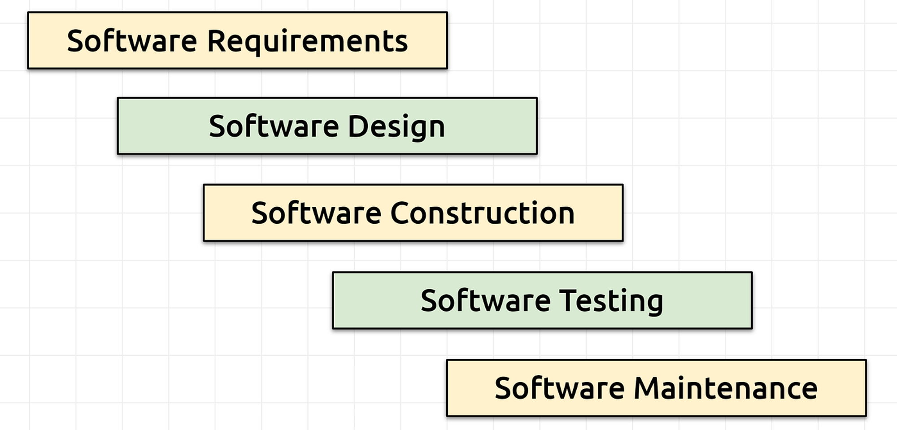
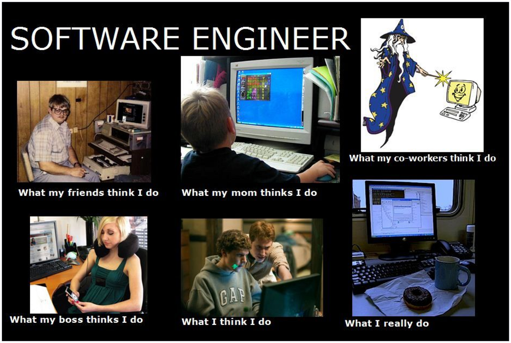
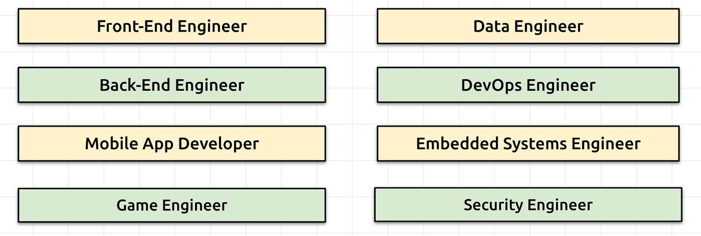
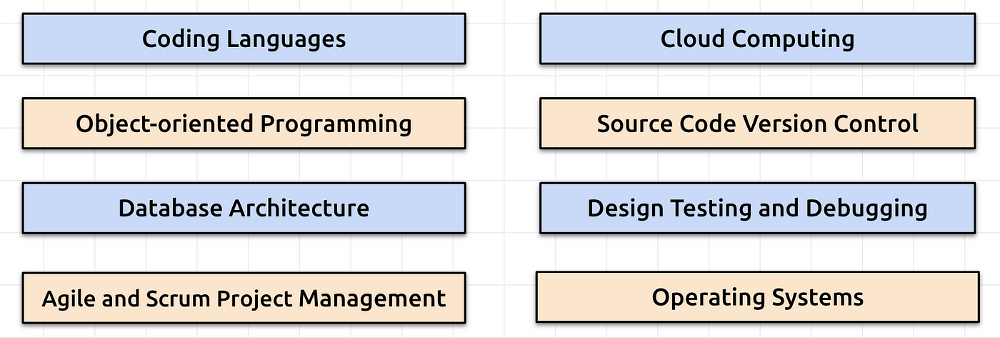
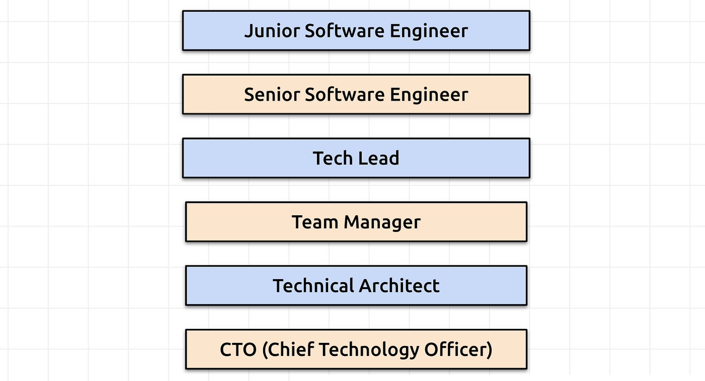
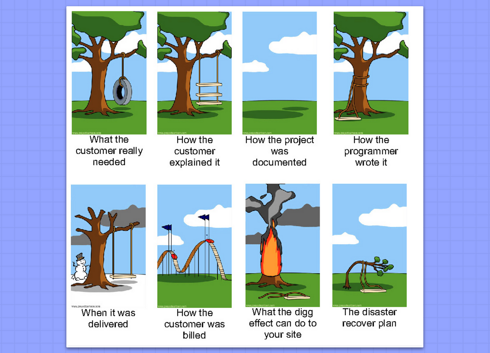

# Road to Software Engineer

ขั้นตอนแรกที่ผมอยากจะแนะนำที่สุดคืออยากให้เรารู้เส้นทางสายงาน IT ที่เรากำลังจะเดินทางไปด้วยกันนี้ก่อนครับผมว่ามีอะไรบ้าง เราอยู่ที่จุดไหนของสายงาน และเราอยากเติบโตไปในแนวทางไหนครับ ผมได้ทำ Video สรุปมาให้ตามนี้นะครับ

<iframe width="560" height="315" src="https://www.youtube.com/embed/W7SzHtGEtyg?si=kib60gegi6kFu64H" title="YouTube video player" frameborder="0" allow="accelerometer; autoplay; clipboard-write; encrypted-media; gyroscope; picture-in-picture; web-share" referrerpolicy="strict-origin-when-cross-origin" allowfullscreen></iframe>

> ขอบคุณเนื้อหาดีๆจาก **[T. T. Software Solution](https://www.tt-ss.net/)**

## **คำถามที่สำคัญอย่างนึงคือ การเขียนโปรแกรมจะอยู่ที่จุดไหนของขั้นตอนในการพัฒนาระบบ**

การแก้ปัญหาด้วยคอมพิวเตอร์มีขั้นตอนสำคัญหลายขั้นตอน:

1. นิยามปัญหาอย่างชัดเจน เพื่อให้ได้ข้อมูลนำเข้าและข้อมูลออกที่ต้องการครบถ้วน
2. ตรวจสอบว่าปัญหามีคำตอบหรือไม่
3. พิจารณาว่าปัญหาสามารถแก้ไขได้ด้วยโปรแกรมคอมพิวเตอร์หรือไม่
4. ออกแบบอัลกอริทึมสำหรับแก้ปัญหา
5. เขียนโปรแกรมตามอัลกอริทึมที่ออกแบบไว้

โดยขั้นตอนที่ 1–4 จะใช้เวลาประมาณ 90% ของเวลาทั้งหมด และใช้กระบวนการคิดทางคณิตศาสตร์เป็นหลัก **ส่วนการเขียนโปรแกรมใช้เวลาเพียง 10%**

ขอบคุณแนวทางการทำงานดีๆจากคุณ [Sanpawat](https://www.facebook.com/bobby.kantabutra/posts/pfbid08H3bbYxaVnDCqBMWynCYiPAPHNhftzsn7wXwYMb1jSTo66hXutCb8Vf2cLeWr9vBl) มากๆคร้าบบบบ 

## **นิยามของ Software Engineering**

**Software Engineering** หมายถึง การประยุกต์ใช้หลักการทางวิศวกรรมในการออกแบบ, พัฒนา, ดูแล, ทดสอบ และประเมินผลซอฟต์แวร์คอมพิวเตอร์ เพื่อให้มั่นใจว่าซอฟต์แวร์มีคุณภาพสูง, มีประสิทธิภาพ, ปลอดภัย และตรงตามความต้องการของผู้ใช้

**แหล่งที่มา:**[Wikipedia — Software Engineering](https://en.wikipedia.org/wiki/Software_engineering)

## **ความแตกต่างระหว่าง Software Engineer และ Programmer**

**Software Engineer:** มุ่งเน้นที่การออกแบบ, การวางแผน และการจัดการโครงการซอฟต์แวร์ ใช้หลักการทางวิศวกรรมเพื่อสร้างซอฟต์แวร์ที่มีคุณภาพสูงและสามารถปรับตัวตามความต้องการที่เปลี่ยนแปลงได้

**Programmer:** มุ่งเน้นที่การเขียนโค้ดและการพัฒนาโปรแกรมตามที่ได้รับการออกแบบจาก Software Engineer งานของ Programmer อาจมีขอบเขตจำกัดในการพัฒนาเฉพาะฟังก์ชันหรือตามคำสั่งที่ได้รับ

เฉียบ… [**pinterest**](https://www.pinterest.com/pin/260927372130615906/)

## **ข้อคิดเพิ่มเติม**

ความแตกต่างระหว่าง Software Engineer และ Programmer อาจมีความยืดหยุ่นและซ้อนทับกันในบางสถานการณ์ ขึ้นอยู่กับขอบเขตงานและวัฒนธรรมองค์กร ในบางกรณี บุคคลเดียวอาจทำหน้าที่ทั้งสองอย่างได้

## **ตัวอย่างตำแหน่งงานนะครับ (จริงๆมีอีกเยอะมากกก)**

Software engineering skills [coursera.org/software-engineer](https://www.coursera.org/articles/software-engineer)

ตัวอย่างความรู้ที่จำเป็นกับการทำงานในสายงานนี้ครับ

Software engineering skills [coursera.org/software-engineer](https://www.coursera.org/articles/software-engineer)

ตำแหน่งในสายงานคร่าวๆนะครับ

A Typical Career Path for a Software Engineering

มุกตลกแถมส่งทายบทครับ : )

อ่านบทความนี้จบ ได้งานให้ลูกค้าตามในภาพนี้ฮาเลย เหะๆ [belitsoft.com/software-requirements-specification-helps-protect-it-projects-failure](https://belitsoft.com/php-development-services/software-requirements-specification-helps-protect-it-projects-failure)