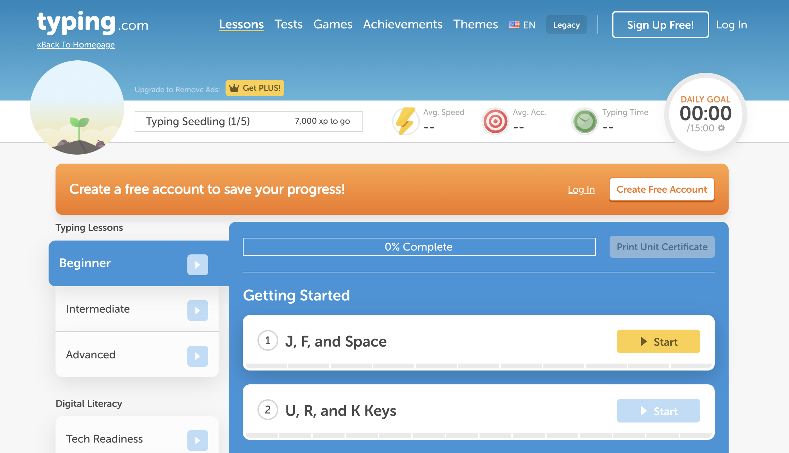
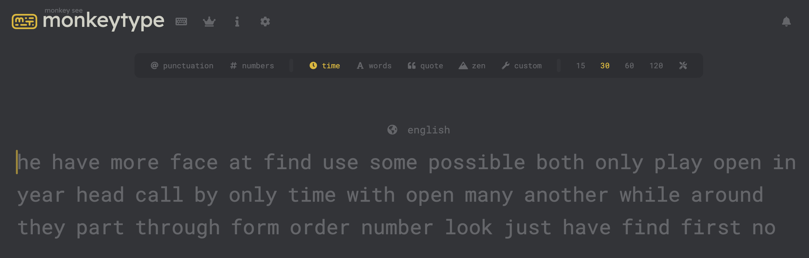

# ฝึกพิมพ์สัมผัสกันครับ

การฝึกพิมพ์สัมผัสสำคัญกับการเขียนโปรแกรมเพราะช่วยเพิ่มความเร็ว ลดข้อผิดพลาด เพิ่มความคล่องตัวในการเขียนโค้ด ประหยัดเวลา และปรับปรุงการทำงานร่วมกันในทีมได้อย่างมีประสิทธิภาพ ผมเลยอยากแนะนำบทเรียนตามนี้ครับ

[typing.com](https://www.typing.com)

[monkeytype.com](https://monkeytype.com)

