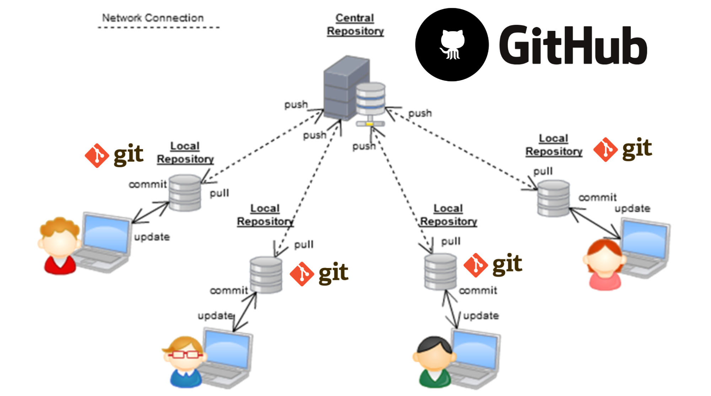
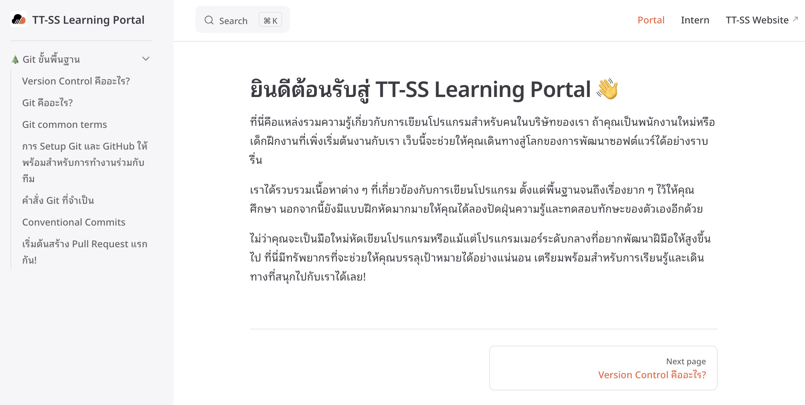
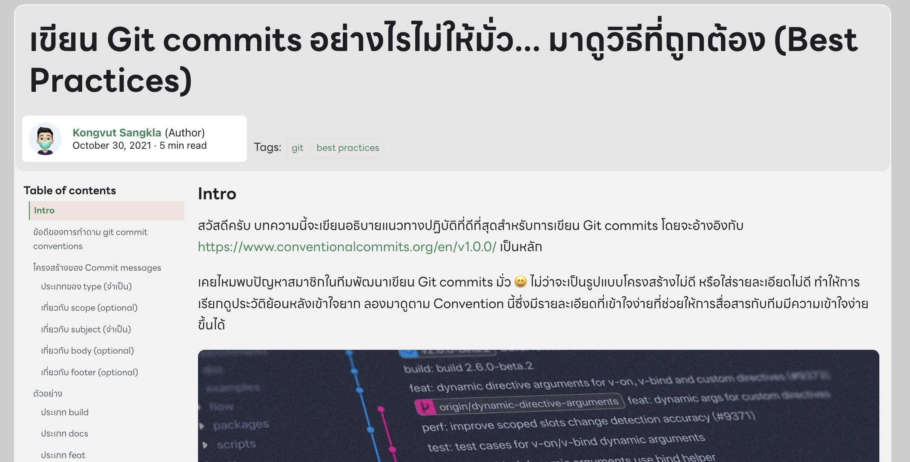

# Git and GitHub

## Git
Git เป็นระบบควบคุมเวอร์ชันแบบกระจาย (Distributed Version Control System) ที่ช่วยให้นักพัฒนาสามารถติดตามการเปลี่ยนแปลงของโค้ด, ทำงานร่วมกันอย่างมีประสิทธิภาพ, และสามารถย้อนกลับไปยังเวอร์ชันก่อนหน้าได้ Git ยังสนับสนุน Branching ซึ่งทำให้การพัฒนาโค้ดใหม่หรือการแก้ไขบั๊กสามารถทำได้อย่างแยกจากกันและรวมกลับมาได้อย่างสะดวก.

## GitHub
### GitHub คืออะไร?

GitHub เป็นแพลตฟอร์มการโฮสต์ซอร์สโค้ดและการควบคุมเวอร์ชันที่ใช้ Git เป็นหลัก GitHub ช่วยให้นักพัฒนาสามารถจัดการโปรเจคของตนได้อย่างมีประสิทธิภาพ โดยมีฟีเจอร์หลายอย่างที่ช่วยในการทำงานร่วมกัน การติดตามบั๊ก และการรีวิวโค้ด



## คุณสมบัติหลักของ GitHub

### 1. Repository
Repository หรือที่เรียกสั้นๆ ว่า "repo" เป็นที่เก็บซอร์สโค้ดและไฟล์ที่เกี่ยวข้องทั้งหมดในโปรเจค สามารถสร้าง repository ได้ทั้งแบบสาธารณะและส่วนตัว

### 2. Branch
Branch ช่วยให้สามารถทำงานแยกจากกันในโปรเจคเดียวกันได้ ช่วยในการพัฒนาและทดสอบฟีเจอร์ใหม่ๆ โดยไม่กระทบต่อโค้ดหลัก

### 3. Pull Request
Pull Request เป็นกระบวนการที่ใช้ในการรวมการเปลี่ยนแปลงจาก branch หนึ่งไปยังอีก branch หนึ่ง ช่วยในการรีวิวโค้ดและการทำงานร่วมกันระหว่างนักพัฒนา

### 4. Issues
Issues ใช้ในการติดตามบั๊ก ฟีเจอร์ที่ต้องการ หรือคำถามต่างๆ ที่เกี่ยวข้องกับโปรเจค ช่วยให้นักพัฒนาสามารถจัดการงานได้อย่างมีระบบ

### 5. Actions
GitHub Actions เป็นฟีเจอร์ที่ช่วยในการตั้งค่า CI/CD (Continuous Integration/Continuous Deployment) สำหรับการทดสอบและปรับใช้โค้ดอัตโนมัติ

### 6. Wikis
Wikis ใช้ในการสร้างเอกสารประกอบโปรเจค ช่วยในการจัดเก็บข้อมูลและคู่มือการใช้งาน

## การเริ่มต้นใช้งาน GitHub

### 1. การสร้างบัญชี GitHub
ไปที่ [GitHub](https://github.com/) และสร้างบัญชีผู้ใช้

### 2. การสร้าง Repository ใหม่

1. ล็อกอินเข้าสู่ GitHub
2. คลิกที่ปุ่ม **New** ที่มุมบนขวาของหน้าจอ
3. กรอกข้อมูลชื่อ repository และรายละเอียดอื่นๆ
4. เลือกว่าจะตั้งค่า repository เป็น **Public** หรือ **Private**
5. คลิกที่ปุ่ม **Create repository**

### 3. การเชื่อมต่อกับ GitHub จากเครื่องคอมพิวเตอร์

ติดตั้ง Git บนเครื่องคอมพิวเตอร์ของคุณ จากนั้นเปิด terminal หรือ command prompt และตั้งค่า Git ด้วยคำสั่งต่อไปนี้:

```bash
git config --global user.name "Your Name"
git config --global user.email "your.email@example.com"
```

### 4. การโคลน (Clone) Repository

เพื่อโคลน repository จาก GitHub มายังเครื่องคอมพิวเตอร์ของคุณ:

```bash
git clone https://github.com/username/repository.git
```

### 5. การเพิ่มและคอมมิตไฟล์

1. เพิ่มไฟล์ใหม่หรือแก้ไขไฟล์ใน repository
2. เพิ่มไฟล์ที่เปลี่ยนแปลงไปยัง staging area:

    ```bash
    git add .
    ```

3. คอมมิตการเปลี่ยนแปลง:

    ```bash
    git commit -m "Initial commit"
    ```

4. ดันการเปลี่ยนแปลงไปยัง GitHub:

    ```bash
    git push origin main
    ```

### 6. การสร้างและใช้งาน Branch

1. สร้าง branch ใหม่:

    ```bash
    git checkout -b new-branch
    ```

2. สลับไปยัง branch ที่สร้างใหม่:

    ```bash
    git checkout new-branch
    ```

3. ดัน branch ใหม่ไปยัง GitHub:

    ```bash
    git push origin new-branch
    ```

### 7. การสร้าง Pull Request

1. ไปที่หน้า repository บน GitHub
2. คลิกที่แท็บ **Pull requests**
3. คลิกที่ปุ่ม **New pull request**
4. เลือก branch ที่ต้องการรวมเข้าด้วยกัน
5. คลิกที่ปุ่ม **Create pull request** และกรอกข้อมูลที่เกี่ยวข้อง
6. คลิกที่ปุ่ม **Create pull request** เพื่อส่ง pull request

## การใช้งาน GitHub Actions

GitHub Actions ช่วยในการตั้งค่า CI/CD เพื่อทดสอบและปรับใช้โค้ดอัตโนมัติ

1. สร้างไฟล์ workflow ในโฟลเดอร์ `.github/workflows`:

    ```yaml
    name: CI

    on: [push, pull_request]

    jobs:
      build:

        runs-on: ubuntu-latest

        steps:
        - uses: actions/checkout@v2
        - name: Set up Node.js
          uses: actions/setup-node@v2
          with:
            node-version: '14'
        - name: Install dependencies
          run: npm install
        - name: Run tests
          run: npm test
    ```

2. คอมมิตและดันไฟล์ workflow ไปยัง repository

GitHub จะรัน workflow ทุกครั้งที่มีการ push หรือ pull request ตามที่กำหนดไว้ในไฟล์ workflow

## สรุป

GitHub เป็นแพลตฟอร์มที่ทรงพลังสำหรับการจัดการซอร์สโค้ดและการทำงานร่วมกันของนักพัฒนา มีฟีเจอร์หลากหลายที่ช่วยในการติดตามการเปลี่ยนแปลง การรีวิวโค้ด และการตั้งค่า CI/CD เพื่อเพิ่มประสิทธิภาพในการพัฒนาและปรับใช้โปรเจคให้ง่ายและเป็นระบบมากขึ้น

## แนะนำคอร์สเรียน
ทีมอยากขอแนะนำเนื้อหาที่น้องยูโรจากบริษัท [**TT Software Solution**](https://www.facebook.com/ttsoftwaresolution) ที่เตรียมมาแนะนำแนวทางการเรียนรู้แนวทางการใช้ Git บน GitHub ครับ

[Git ขั้นพื้นฐาน](https://learning-ttss.vercel.app/portal.html)



แถมเนื้อหาดีๆจาก BorntoDev อีกแล้วครับท่านนนน

[เรียนฟรี!! GithHub For Developer 2 ชั่วโมงเต็ม ตั้งแต่เริ่มต้นจนถึงระดับมือโปร](https://www.youtube.com/watch?v=fOlDcMStMXE)
<iframe width="560" height="315" src="https://www.youtube.com/embed/fOlDcMStMXE?si=zftPMNi6tLLmKBJK" title="YouTube video player" frameborder="0" allow="accelerometer; autoplay; clipboard-write; encrypted-media; gyroscope; picture-in-picture; web-share" referrerpolicy="strict-origin-when-cross-origin" allowfullscreen></iframe>

[เขียน Git commits อย่างไรไม่ให้มั่ว... มาดูวิธีที่ถูกต้อง (Best Practices)](https://blog.2my.xyz/2021/10/30/git-conventional-commits/)
