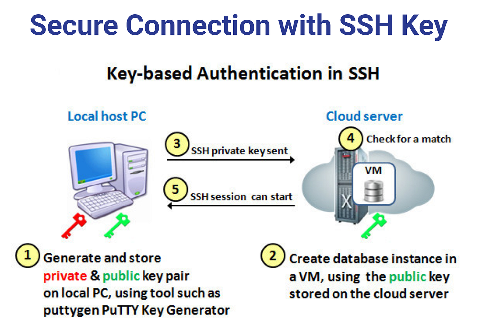

# SSH (Secure Shell) คืออะไร?

**SSH (Secure Shell)** คือโปรโตคอลที่ใช้สำหรับการสื่อสารระหว่างเครื่องคอมพิวเตอร์ผ่านเครือข่ายโดยมีการเข้ารหัสเพื่อเพิ่มความปลอดภัย SSH ถูกใช้บ่อยในการเข้าถึงและจัดการเครื่องเซิร์ฟเวอร์จากระยะไกลอย่างปลอดภัย

การสื่อสารด้วย SSH มีการเข้ารหัสข้อมูลที่ส่งระหว่างเครื่องต้นทางและเครื่องปลายทาง เพื่อป้องกันการดักฟังและการแก้ไขข้อมูลโดยบุคคลที่สาม

## ส่วนประกอบของ SSH

### 1. The Public Key
Public key ถูกสร้างจากเครื่องต้นทางและนำไปวางไว้บนเครื่องเซิร์ฟเวอร์ปลายทาง ใช้สำหรับการทำ public-key cryptography

### 2. The Private Key
Private key ถูกสร้างมาพร้อมกับ public key แต่จะถูกเก็บไว้ในเครื่องต้นทางเท่านั้น ใช้สำหรับการพิสูจน์ตัวตนว่าเรามีสิทธิ์ในการเข้าถึงเครื่องเซิร์ฟเวอร์จริงๆ



## ขั้นตอนการสร้าง SSH Key Pair และการใช้งาน

### ขั้นตอนที่ 1: สร้าง SSH Key Pair

คุณสามารถใช้คำสั่ง `ssh-keygen` ในการสร้างคู่กุญแจ SSH (SSH Key Pair) บนเครื่องของคุณ:

```bash
ssh-keygen -t rsa -b 4096 -C "your_email@example.com"
```

คำอธิบาย:

- `-t rsa`: ระบุประเภทของกุญแจที่ใช้สร้าง (ในที่นี้คือ RSA)
- `-b 4096`: ระบุความยาวของกุญแจ (ในที่นี้คือ 4096 บิต)
- `-C "your_email@example.com"`: เพิ่มคอมเมนต์ไปยังกุญแจ (มักใช้เป็นอีเมลของคุณ)

หลังจากรันคำสั่งนี้ คุณจะต้องตอบคำถามบางอย่าง เช่น ตำแหน่งที่ต้องการเก็บกุญแจและพาสเฟส (passphrase) เพื่อเพิ่มความปลอดภัย (สามารถกด Enter เพื่อใช้ค่าเริ่มต้นได้)

### ขั้นตอนที่ 2: คัดลอก Public Key ไปยังเซิร์ฟเวอร์

ใช้คำสั่ง `ssh-copy-id` เพื่อคัดลอก public key ของคุณไปยังเซิร์ฟเวอร์:

```bash
ssh-copy-id username@remote_host
```

คำอธิบาย:

- `username`: ชื่อผู้ใช้บนเครื่องเซิร์ฟเวอร์
- `remote_host`: ที่อยู่ IP หรือชื่อโดเมนของเครื่องเซิร์ฟเวอร์

คำสั่งนี้จะคัดลอก public key ของคุณไปยังไฟล์ `~/.ssh/authorized_keys` บนเครื่องเซิร์ฟเวอร์

### ขั้นตอนที่ 3: เข้าถึงเซิร์ฟเวอร์ด้วย SSH

หลังจากคัดลอก public key ไปยังเซิร์ฟเวอร์แล้ว คุณสามารถใช้คำสั่ง `ssh` เพื่อเข้าสู่เครื่องเซิร์ฟเวอร์ได้:

```bash
ssh username@remote_host
```

คำอธิบาย:

- `username`: ชื่อผู้ใช้บนเครื่องเซิร์ฟเวอร์
- `remote_host`: ที่อยู่ IP หรือชื่อโดเมนของเครื่องเซิร์ฟเวอร์

ตัวอย่างการใช้งาน:

```bash
$ ssh-keygen -t rsa -b 4096 -C "user@example.com"
Generating public/private rsa key pair.
Enter file in which to save the key (/home/user/.ssh/id_rsa): 
Created directory '/home/user/.ssh'.
Enter passphrase (empty for no passphrase): 
Enter same passphrase again: 
Your identification has been saved in /home/user/.ssh/id_rsa.
Your public key has been saved in /home/user/.ssh/id_rsa.pub.
The key fingerprint is:
SHA256:...
The key's randomart image is:
+---[RSA 4096]----+
|  ..             |
| .o o            |
|..+o+o           |
|oo.*X..          |
| +B=..o S        |
| +.=...          |
|  o . .          |
| E               |
+----[SHA256]-----+

$ ssh-copy-id user@192.168.1.100
/usr/bin/ssh-copy-id: INFO: Source of key(s) to be installed: "/home/user/.ssh/id_rsa.pub"
The authenticity of host '192.168.1.100 (192.168.1.100)' can't be established.
ECDSA key fingerprint is SHA256:...
Are you sure you want to continue connecting (yes/no)? yes
/usr/bin/ssh-copy-id: INFO: attempting to log in with the new key(s), to filter out any that are already installed

user@192.168.1.100's password: 

Number of key(s) added: 1

Now try logging into the machine, with:   "ssh 'user@192.168.1.100'"
and check to make sure that only the key(s) you wanted were added.

$ ssh user@192.168.1.100
Welcome to Ubuntu 20.04 LTS (GNU/Linux 5.4.0-26-generic x86_64)

...

user@remote_host:~$
```

## ข้อดีของการใช้ SSH

1. **ความปลอดภัย**: ข้อมูลที่ส่งผ่าน SSH ถูกเข้ารหัส ทำให้ปลอดภัยจากการดักฟัง
2. **การพิสูจน์ตัวตนที่ปลอดภัย**: ใช้คู่กุญแจ (key pair) สำหรับการพิสูจน์ตัวตน ทำให้ยากต่อการถูกโจมตีด้วย brute-force
3. **ความสะดวกในการใช้งาน**: สามารถเข้าถึงและจัดการเซิร์ฟเวอร์จากระยะไกลได้ง่าย

การใช้ SSH ช่วยให้การสื่อสารระหว่างเครื่องคอมพิวเตอร์ผ่านเครือข่ายเป็นไปอย่างปลอดภัยและมีประสิทธิภาพ เหมาะสำหรับการจัดการและดูแลเซิร์ฟเวอร์จากระยะไกล

## แนะนำบทเรียน

[บันทึกชีวิตที่สะดวกสบายขึ้นด้วย VS Code Remote SSH](https://medium.com/t-t-software-solution/%E0%B8%9A%E0%B8%B1%E0%B8%99%E0%B8%97%E0%B8%B6%E0%B8%81%E0%B8%8A%E0%B8%B5%E0%B8%A7%E0%B8%B4%E0%B8%95%E0%B8%97%E0%B8%B5%E0%B9%88%E0%B8%AA%E0%B8%B0%E0%B8%94%E0%B8%A7%E0%B8%81%E0%B8%AA%E0%B8%9A%E0%B8%B2%E0%B8%A2%E0%B8%82%E0%B8%B6%E0%B9%89%E0%B8%99%E0%B8%94%E0%B9%89%E0%B8%A7%E0%B8%A2-vs-code-remote-ssh-ddbd19ea19bd)

