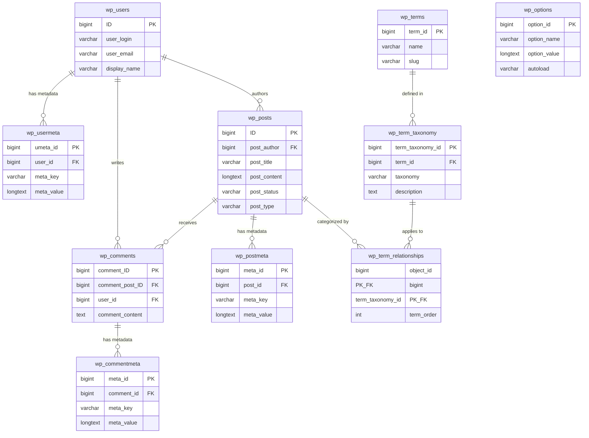

# โครงสร้างของ WordPress
WordPress มีโครงสร้างของระบบจัดการเนื้อหาที่ประกอบด้วยส่วนต่างๆ ดังนี้ 

## องค์ประกอบหลักของ WordPress
1. ส่วนหน้าตาเว็บไซต์ (Frontend)
2. ส่วนจัดการเนื้อหา (Backend)
3. ส่วนสำหรับเชื่อมต่อกับระบบอื่นๆ (API)
4. ส่วนที่เป็นคำสั่ง (CLI)
5. ฐานข้อมูล MySQL Database

## โฟลเดอร์หลักของ WordPress  
- `wp-admin` สำหรับจัดการเนื้อหา
- `wp-includes` สำหรับคำสั่งต่างๆ ที่ใช้ในการจัดการเนื้อหา
- `wp-content` สำหรับส่วนของเนื้อหาที่สร้างขึ้นเองโดยผู้ใช้

## ไฟล์สำคัญอื่นๆ ดังนี้  
- `index.php` เป็นไฟล์หลักของ WordPress ที่ใช้ในเรียกใช้งานระบบ
- `wp-config.php` เป็นไฟล์ที่ใช้ในการตั้งค่าของระบบ เช่น ฐานข้อมูล คีย์สำคัญ การ debug และอื่นๆ

## โฟลเดอร์ที่ควรรู้ใน `wp-content`  
- `plugins` สำหรับติดตั้งส่วนของเนื้อหาที่สร้างขึ้นเองโดยผู้ใช้
- `themes` สำหรับติดตั้งส่วนของเนื้อหาที่สร้างขึ้นเองโดยผู้ใช้
- `uploads` สำหรับรวมภาพประกอบต่างๆ ที่อัปโหลดโดยผู้ใช้

## โครงสร้างของฐานข้อมูล  
ฐานข้อมูลของ WordPress ประกอบด้วยตารางต่างๆ ดังนี้  

1. `wp_options` สำหรับตั้งค่าของระบบ เช่น คีย์สำคัญ การ debug และอื่นๆ
2. `wp_posts` สำหรับการจัดเก็บเนื้อหาของเว็บไซต์
3. `wp_users` สำหรับการจัดเก็บข้อมูลผู้ใช้
4. `wp_comments` สำหรับการจัดเก็บข้อมูลคอมเม้นต์ของเนื้อหา
5. `wp_terms` สำหรับการจัดเก็บข้อมูลหมวดหมู่ของเนื้อหา
6. `wp_term_relationships` สำหรับการจัดเก็บข้อมูลความสัมพันธ์ระหว่างหมวดหมู่ของเนื้อหา
7. `wp_term_taxonomy` สำหรับการจัดเก็บข้อมูลประเภทของหมวดหมู่ของเนื้อหา
8. `wp_postmeta` สำหรับการจัดเก็บข้อมูลเมตาของเนื้อหา
9. `wp_usermeta` สำหรับการจัดเก็บข้อมูลเมตาของผู้ใช้
10. `wp_comments` สำหรับการจัดเก็บข้อมูลคอมเม้นต์ของเนื้อหา
11. `wp_commentmeta` สำหรับการจัดเก็บข้อมูลเมตาของคอมเม้นต์
12. `wp_links` เก็บข้อมูลที่เกี่ยวข้องกับลิงก์ที่ป้อนลงในคุณสมบัติลิงก์ของ WordPress (คุณลักษณะนี้เลิกใช้แล้ว แต่สามารถเปิดใช้งานได้อีกครั้งด้วยปลั๊กอินตัวจัดการลิงก์)